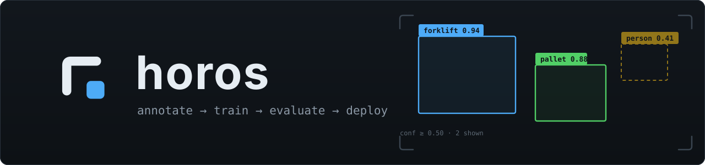
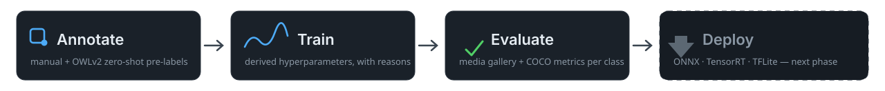

<div align="center">



<br>

[![Stargazers][stars-shield]][stars-url]
[![Issues][issues-shield]][issues-url]
[![License][license-shield]][license-url]

**horos** (ὅρος — *boundary, definition*) is the path that takes a detection
model into production: one tool that carries a dataset from raw images through
annotation, training, and evaluation to a deployable artifact — with a web UI,
a Python API, and a CLI that share one capability set.

[Quickstart](#quickstart) ·
[Web UI](#web-ui) ·
[Models](#models) ·
[Platforms](#platform-support) ·
[Installation](#installation) ·
[Roadmap](#roadmap)

</div>

## Quickstart

Install ([details & Jetson notes below](#installation)):

```bash
pip install horos
horos doctor        # verifies the environment; --fix installs what's missing
```

Run the whole pipeline from the terminal:

```bash
horos init my-project                   # new project directory
horos import my-project path/to/data    # COCO / YOLO / VOC / Darknet / VIA, dir or zip
horos ui my-project                     # web UI: dataset, annotate, train, evaluate
```

Or from Python — every UI action has a scriptable twin:

```python
import horos.api as api

project = api.open_project("my-project")
record = api.start_training(project, api.TrainRunConfig(model="rfdetr-small"))
# ... poll api.training_status(project, record.run_id) ...
report = api.get_eval_report(project, record.run_id, "test")
```

<div align="center">
  
</div>

## Web UI

`horos ui <project>` serves four pages on localhost:

| Page | What it does |
|---|---|
| **Dataset** | import (drag a zip), validation with actionable errors, class stats, train/valid/test re-splitting |
| **Annotate** | keyboard-first canvas (bbox + polygon), OWLv2 zero-shot pre-labels with an accept/fix/reject review flow, resume where you left off, safe for multiple annotators |
| **Training** | one-click start — hyperparameters are derived from your dataset's statistics **with the reasoning shown**, and every value can be overridden; live loss/mAP curves, run queue with in-place editing, resume with full optimizer state, OOM auto-backoff, post-run verdict with concrete suggestions |
| **Evaluate** | drop photos, GIFs, or videos onto a trained model and browse per-frame predictions in a gallery viewer (confidence slider, frame-by-frame navigation); COCO metrics with per-class AP and PR curves |

## Models

All registered weights are Apache-2.0. Nothing is bundled — weights download
on first use and cache locally.

**Detection (trainable)**

| Model | Params | Input | Notes |
|---|---|---|---|
| RF-DETR Nano | 30.5 M | 384 px | fastest — Jetson-friendly real-time |
| RF-DETR Small | 32.1 M | 512 px | fast — good default for Jetson |
| RF-DETR Medium | 33.7 M | 576 px | balanced accuracy/latency |
| RF-DETR Large | 129 M | 704 px | highest accuracy — desktop GPU recommended |

**Annotation assistants (not for deployment)**

| Model | Params | Role |
|---|---|---|
| OWLv2 Base / Large | 155 M / 437 M | open-vocabulary zero-shot pre-labeling from text prompts |
| SAM ViT-B | 94 M | turns autolabel boxes into polygon masks |

RF-DETR XL/2XL are deliberately unregistered: their weights are not Apache-2.0
(PML 1.0). Loading them requires an explicit `acknowledge_non_apache=True`.

## Platform support

| Capability | Ubuntu (CUDA) | Windows | macOS | Jetson |
|---|:-:|:-:|:-:|:-:|
| Dataset management & annotation | ✅ | ✅ | ✅ | ✅ |
| Auto-labeling (OWLv2) | ✅ | ✅ | ✅ (MPS/CPU, slower) | ✅ |
| Training | ✅ | ✅ | small-dataset validation only | discouraged, not blocked |
| Inference & evaluation | ✅ | ✅ | ✅ | ✅ |
| TensorRT export *(planned)* | ✅ | ✅ | ❌ refused explicitly | ✅ |

Unsupported combinations raise a clear error at the API layer and show up as
disabled buttons with an explanation in the UI — never a silent CPU fallback.
Device priority: CUDA → MPS → CPU, recorded in each run's metadata.

## Installation

The install scripts detect your platform (OS, NVIDIA GPU, Jetson) and install
the matching torch build plus horos into `./.venv`:

```bash
./install.sh        # Ubuntu / macOS / Jetson
install.bat         # Windows
```

<details>
<summary>What the scripts decide for you</summary>

| Platform | torch source |
|---|---|
| Linux + NVIDIA GPU | PyPI (Linux wheels bundle CUDA) |
| Linux without GPU | PyTorch CPU index (saves ~2 GB) |
| macOS | PyPI universal build (MPS) |
| Windows + NVIDIA GPU | PyTorch index matching your CUDA (cu118/cu124/cu126) — the PyPI Windows wheel is CPU-only |
| Windows without GPU | PyPI (CPU) |
| Jetson | **never installed by the script** — see below |

</details>

**Use a dedicated environment.** horos pins `rfdetr` exactly (upstream has had
silent annotation-corruption bugs; reproducibility wins) and requires
`transformers >= 5.1` — installing into a shared ML environment will upgrade
`transformers`, `supervision`, `huggingface-hub` and friends, which can break
other projects living in that environment.

### Jetson (read this — it matters)

On Jetson, torch **must** come from NVIDIA's JetPack-matched wheel. The PyPI
torch has no CUDA support on Jetson, and a plain `pip install horos` may
silently replace your CUDA-enabled torch with a CPU-only build — everything
still runs, just an order of magnitude slower.

`./install.sh` handles this automatically on Jetson: it creates the venv with
`--system-site-packages`, verifies the existing torch has CUDA (warning loudly
if not), and installs horos with `--no-deps` so pip can never swap torch out.
horos also warns at backend load time when it detects a Jetson platform where
`torch.cuda.is_available()` is False.

<details>
<summary>Jetson install by hand</summary>

```bash
pip install horos --no-deps
pip install pydantic flask pyyaml pillow imageio imageio-ffmpeg "transformers>=5.1,<6"
# torch/torchvision: use the NVIDIA wheel matching your JetPack version — FIRST,
# because the training stack below declares torch as a dependency
pip install "rfdetr==1.9.4" --no-deps
pip install supervision pycocotools scipy peft \
    "pytorch_lightning>=2.6,!=2.6.2,!=2.6.3,<3" \
    "torchmetrics[detection]>=1.2" "faster-coco-eval>=1.7.2"
```

</details>

## Roadmap

- [x] Project & dataset core — formats, validation, stats, splits
- [x] Manual annotation — bbox + polygon, multi-annotator
- [x] Auto-labeling — OWLv2 open-vocabulary, review workflow
- [x] Training — derived hyperparameters, queue, resume, live monitoring
- [x] Evaluation — media gallery, COCO metrics, per-class analysis
- [ ] Error analysis — confusion pairs, worst-case mining
- [ ] Experiment management — run comparison, dataset fingerprints
- [ ] Export & deploy — ONNX / TensorRT / TFLite, model cards, parity checks

## Development

```bash
python -m venv .venv && . .venv/bin/activate
pip install -e . --no-deps
pip install pydantic flask pyyaml pillow imageio pytest ruff
pytest tests/test_invariants.py && pytest
```

`tests/test_invariants.py` runs first for a reason: it statically enforces the
architecture — model dependencies live only in `horos/backends/`, `import horos`
never drags in torch, and the UI talks to the core exclusively through the web
API. Models are adapters; the workflow is the product.

## License

Distributed under the [Apache License 2.0](LICENSE). Model weights are
downloaded at runtime and cached locally — horos never bundles or
redistributes them, and each model's license is recorded in the registry,
shown in the UI, and stamped into every training run.

## Acknowledgments

[RF-DETR](https://github.com/roboflow/rf-detr) by Roboflow ·
[OWLv2](https://arxiv.org/abs/2306.09683) by Google Research ·
[Segment Anything](https://segment-anything.com/) by Meta AI

[stars-shield]: https://img.shields.io/github/stars/SJ-Chuang/horos.svg?style=for-the-badge
[stars-url]: https://github.com/SJ-Chuang/horos/stargazers
[issues-shield]: https://img.shields.io/github/issues/SJ-Chuang/horos.svg?style=for-the-badge
[issues-url]: https://github.com/SJ-Chuang/horos/issues
[license-shield]: https://img.shields.io/github/license/SJ-Chuang/horos.svg?style=for-the-badge
[license-url]: https://github.com/SJ-Chuang/horos/blob/main/LICENSE
