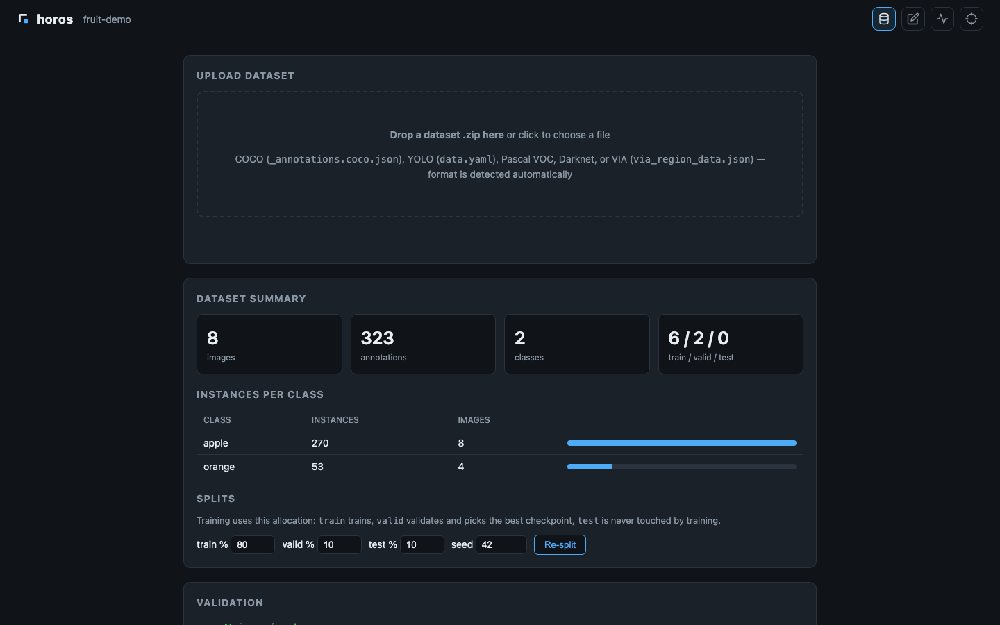
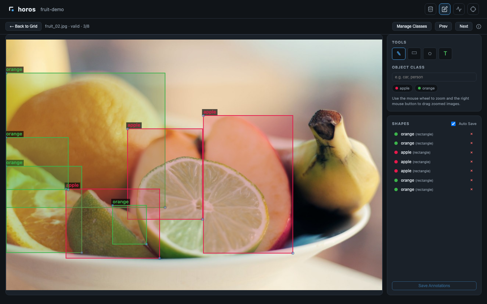
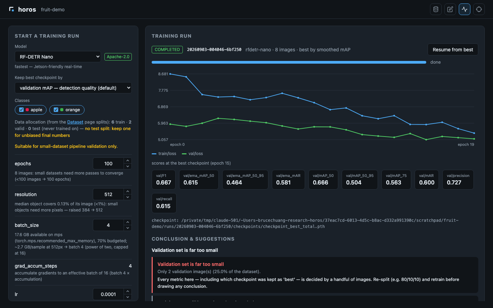
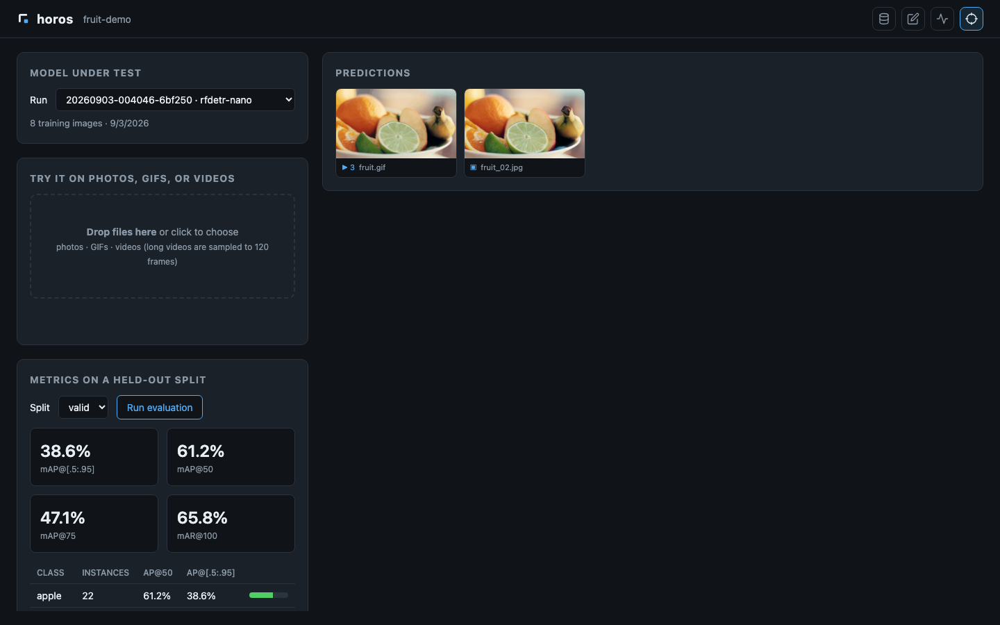

<div align="center">


<br>

[![Stargazers][stars-shield]][stars-url]
[![Issues][issues-shield]][issues-url]
[![License][license-shield]][license-url]

**horos** (ὅρος — *boundary, definition*) is the path that takes a detection
model into production: one tool that carries a dataset from raw images through
annotation, training, and evaluation to a deployable artifact — with a web UI,
a Python API, and a CLI that share one capability set.

[Quickstart](#quickstart) ·
[Web UI](#web-ui) ·
[Models](#models) ·
[Platforms](#platform-support) ·
[Installation](#installation) ·
[Roadmap](#roadmap)

</div>

## Quickstart

Install ([details & Jetson notes below](#installation)):

```bash
pip install horos   # lightweight core: datasets, annotation, web UI — no torch
horos install       # ML stack (torch / rfdetr / transformers), matched to your machine
horos doctor        # verifies the environment; --fix installs what's missing
```

`pip install horos` deliberately ships without the ML stack: the right torch
build depends on your platform (Windows needs a CUDA index, Jetson needs the
JetPack wheel, GPU-less Linux wants the 2 GB-smaller CPU build) and pip cannot
make that call. `horos install` detects your GPU and installs the right
builds; ML commands check the environment on startup and tell you exactly
what to run if something is missing or mis-built.

Run the whole pipeline from the terminal:

```bash
horos init my-project                   # new project directory
horos import my-project path/to/data    # COCO / YOLO / VOC / Darknet / VIA, dir or zip
horos ui my-project                     # web UI: dataset, annotate, train, evaluate
```

Or from Python — every UI action has a scriptable twin:

```python
import horos.api as api

project = api.open_project("my-project")
record = api.start_training(project, api.TrainRunConfig(model="rfdetr-small"))
# ... poll api.training_status(project, record.run_id) ...
report = api.get_eval_report(project, record.run_id, "test")
```

<div align="center">
  
</div>

## Web UI

`horos ui <project>` serves four pages on localhost.

### Dataset

Import by dropping a zip (COCO / YOLO / VOC / Darknet / VIA — format is
auto-detected), get a validation report with actionable errors, per-class
statistics, and train/valid/test re-splitting.



### Annotate

A keyboard-first canvas for boxes and polygons. OWLv2 turns text prompts into
zero-shot pre-labels, so annotators start from *correcting* instead of from a
blank image — with an accept / fix / reject review flow, and safe concurrent
annotation for teams.



### Train

One click to start: hyperparameters are derived from your dataset's statistics
**with the reasoning shown**, and every value can be overridden. Live loss/mAP
curves, a run queue with in-place editing, resume with full optimizer state,
OOM auto-backoff, a selectable best-checkpoint criterion, and a post-run
verdict with concrete suggestions.



### Evaluate

Drop photos, GIFs, or videos onto a trained model and browse per-frame
predictions in a gallery viewer (confidence slider, frame-by-frame
navigation). COCO metrics with per-class AP and PR curves, persisted per run.



## Models

All registered weights are Apache-2.0. Nothing is bundled — weights download
on first use and cache locally.

**Detection (trainable)**

| Model | Params | Input | Notes |
|---|---|---|---|
| RF-DETR Nano | 30.5 M | 384 px | fastest — Jetson-friendly real-time |
| RF-DETR Small | 32.1 M | 512 px | fast — good default for Jetson |
| RF-DETR Medium | 33.7 M | 576 px | balanced accuracy/latency |
| RF-DETR Large | 129 M | 704 px | highest accuracy — desktop GPU recommended |

**Annotation assistants (not for deployment)**

| Model | Params | Role |
|---|---|---|
| OWLv2 Base / Large | 155 M / 437 M | open-vocabulary zero-shot pre-labeling from text prompts |
| SAM ViT-B | 94 M | turns autolabel boxes into polygon masks |

RF-DETR XL/2XL are deliberately unregistered: their weights are not Apache-2.0
(PML 1.0). Loading them requires an explicit `acknowledge_non_apache=True`.

## Platform support

| Capability | Ubuntu (CUDA) | Windows | macOS | Jetson |
|---|:-:|:-:|:-:|:-:|
| Dataset management & annotation | ✅ | ✅ | ✅ | ✅ |
| Auto-labeling (OWLv2) | ✅ | ✅ | ✅ (MPS/CPU, slower) | ✅ |
| Training | ✅ | ✅ | small-dataset validation only | discouraged, not blocked |
| Inference & evaluation | ✅ | ✅ | ✅ | ✅ |
| TensorRT export *(planned)* | ✅ | ✅ | ❌ refused explicitly | ✅ |

Unsupported combinations raise a clear error at the API layer and show up as
disabled buttons with an explanation in the UI — never a silent CPU fallback.
Device priority: CUDA → MPS → CPU, recorded in each run's metadata.

## Installation

Two steps, on every platform:

```bash
pip install horos   # the core — datasets, annotation, web UI (no ML deps)
horos install       # the ML stack, matched to this machine
```

`horos install` detects your OS, NVIDIA driver and CUDA version and runs the
right pip commands (`--dry-run` shows them first, `--cpu` forces the CPU
build). `horos doctor` re-checks everything and plans the same fixes — it also
catches the classic trap of a CPU-only torch sitting on a GPU machine.

<details>
<summary>What <code>horos install</code> decides for you</summary>

| Platform | torch source |
|---|---|
| Linux + NVIDIA GPU | PyPI (Linux wheels bundle CUDA) |
| Linux without GPU | PyTorch CPU index (saves ~2 GB) |
| macOS | PyPI universal build (MPS) |
| Windows + NVIDIA GPU | PyTorch index matching your driver's CUDA (cu118 … cu132) — the PyPI Windows wheel is CPU-only |
| Windows without GPU | PyPI (CPU) |
| Jetson | **never pip-installed** — see below |

For Linux/x86_64 CI and containers where the default PyPI torch is already
right, `pip install horos[ml]` installs the same stack in one shot.

</details>

The repo also ships bootstrap scripts that create `./.venv`, install the core,
and run `horos install` for you:

```bash
./install.sh        # Ubuntu / macOS / Jetson
install.bat         # Windows
```

**Use a dedicated environment.** horos pins `rfdetr` exactly (upstream has had
silent annotation-corruption bugs; reproducibility wins) and requires
`transformers >= 5.1` — installing into a shared ML environment will upgrade
`transformers`, `supervision`, `huggingface-hub` and friends, which can break
other projects living in that environment.

### Jetson (read this — it matters)

On Jetson, torch **must** come from NVIDIA's JetPack-matched wheel — the PyPI
torch has no CUDA support there. `pip install horos` is safe (the core has no
torch dependency), and `horos install` never pip-installs torch on Jetson: it
prints the JetPack steps, installs `rfdetr` with `--no-deps` so pip can never
swap torch out, and adds the training stack once the JetPack torch is in
place. horos also warns at backend load time when it detects a Jetson
platform where `torch.cuda.is_available()` is False.

Use a venv created with `--system-site-packages` so the JetPack torch stays
visible (`./install.sh` does this automatically on Jetson):

```bash
pip install horos
# torch/torchvision: install the NVIDIA wheel matching your JetPack version —
# https://docs.nvidia.com/deeplearning/frameworks/install-pytorch-jetson-platform/
horos install       # rfdetr (--no-deps), training stack, transformers
```

## Roadmap

- [x] Project & dataset core — formats, validation, stats, splits
- [x] Manual annotation — bbox + polygon, multi-annotator
- [x] Auto-labeling — OWLv2 open-vocabulary, review workflow
- [x] Training — derived hyperparameters, queue, resume, live monitoring
- [x] Evaluation — media gallery, COCO metrics, per-class analysis
- [ ] Error analysis — confusion pairs, worst-case mining
- [ ] Experiment management — run comparison, dataset fingerprints
- [ ] Export & deploy — ONNX / TensorRT / TFLite, model cards, parity checks

## Development

```bash
python -m venv .venv && . .venv/bin/activate
pip install -e .[dev]      # the core is torch-free by design
horos install              # ML stack — needed for the backend/training tests
pytest tests/test_invariants.py && pytest
```

`tests/test_invariants.py` runs first for a reason: it statically enforces the
architecture — model dependencies live only in `horos/backends/`, `import horos`
never drags in torch, and the UI talks to the core exclusively through the web
API. Models are adapters; the workflow is the product.

## License

Distributed under the [Apache License 2.0](LICENSE). Model weights are
downloaded at runtime and cached locally — horos never bundles or
redistributes them, and each model's license is recorded in the registry,
shown in the UI, and stamped into every training run.

## Acknowledgments

[RF-DETR](https://github.com/roboflow/rf-detr) by Roboflow ·
[OWLv2](https://arxiv.org/abs/2306.09683) by Google Research ·
[Segment Anything](https://segment-anything.com/) by Meta AI

[stars-shield]: https://img.shields.io/github/stars/SJ-Chuang/horos.svg?style=for-the-badge
[stars-url]: https://github.com/SJ-Chuang/horos/stargazers
[issues-shield]: https://img.shields.io/github/issues/SJ-Chuang/horos.svg?style=for-the-badge
[issues-url]: https://github.com/SJ-Chuang/horos/issues
[license-shield]: https://img.shields.io/github/license/SJ-Chuang/horos.svg?style=for-the-badge
[license-url]: https://github.com/SJ-Chuang/horos/blob/main/LICENSE
